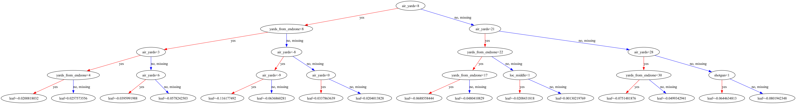

# NFL Analytics Pipeline

A production-style NFL data pipeline with a machine learning layer. Raw play-by-play data flows through ingestion, DuckDB, dbt transformations, Prefect orchestration, a Streamlit dashboard, and an XGBoost completion probability model.

```
nflreadpy → Parquet → DuckDB → dbt → Prefect → Streamlit + XGBoost
```

---

## Tech Stack

| Layer | Tool | Reason |
|---|---|---|
| Data source | `nflreadpy` | Official successor to `nfl_data_py`; Python 3.12 compatible; Polars-native |
| Raw storage | Parquet (snappy) | Columnar, fast reads, regenerable |
| Query engine | DuckDB | OLAP, reads Parquet natively, no server required |
| Transformation | dbt | Three-layer model structure, testing, auto-docs |
| Orchestration | Prefect | Scheduled weekly pipeline runs |
| Dashboard | Streamlit | Interactive QB analytics dashboard |
| ML | XGBoost | Gradient-boosted pass completion probability model |

---

## Project Structure

```
NFL-Projects/
├── ingestion/
│   ├── pull_pbp.py          # Pull PBP data from nflverse, write Parquet
│   └── load_duckdb.py       # Register Parquet files as DuckDB views
├── nfl_analytics/           # dbt project
│   └── models/
│       ├── staging/         # stg_pbp.sql, clean & rename raw columns
│       ├── intermediate/    # int_qb_plays.sql, per-play passing metrics
│       └── marts/           # mart_qb_season.sql, QB season aggregates
├── flows/
│   └── nfl_pipeline.py      # Prefect orchestration flow
├── dashboard/
│   └── app.py               # Streamlit dashboard (Season Stats + ML CPOE tabs)
├── ml/
│   ├── train.py             # Feature engineering, model training, evaluation
│   ├── predict.py           # Per-play predictions, QB CPOE comparison table
│   └── calibration_plot.png # Calibration curve output from train.py
├── db/
│   └── nfl.duckdb           # DuckDB file (gitignored, regenerable)
├── data/
│   └── raw/                 # Parquet files (gitignored, regenerable)
├── queries/
│   └── qb_completion.sql    # Validated Phase 2 reference query
├── profiles.yml.example     # dbt profile template
└── requirements.txt
```

---

## Setup

### 1. Clone and create virtual environment

```bash
git clone https://github.com/hsamala688/NFL_Projects.git
cd NFL-Projects
python3.12 -m venv venv
source venv/bin/activate
pip install -r requirements.txt
```

### 2. Configure dbt profile

Copy the template and edit the path to match your local setup:

```bash
cp profiles.yml.example ~/.dbt/profiles.yml
```

The profile should point to `db/nfl.duckdb` using an absolute path:

```yaml
nfl_analytics:
  outputs:
    dev:
      type: duckdb
      path: /your/path/to/NFL-Projects/db/nfl.duckdb
      threads: 4
  target: dev
```

### 3. Run the full pipeline

```bash
# Pull raw data (add seasons as needed for ML training)
python ingestion/pull_pbp.py --seasons 2020 2021 2022 2023 2024 2025

# Register DuckDB views
python ingestion/load_duckdb.py

# Run dbt models and tests
cd nfl_analytics && dbt run && dbt test
```

### 4. Train the ML model

```bash
# Trains on 2020–2024, evaluates on 2025, saves xgb_model.json
python ml/train.py
```

### 5. Launch the dashboard

```bash
# From repo root, loads the saved model and runs live predictions
streamlit run dashboard/app.py
```

---

## dbt Models

### Staging (`stg_pbp`)
Selects and renames relevant columns from the raw `pbp` DuckDB view. No business logic, just cleaning.

### Intermediate (`int_qb_plays`)
Filters to regular season passing plays (`complete_pass`, `incomplete_pass`, or `interception`), computes per-play metrics (EPA, air yards, CPOE, WPA), and classifies plays into distance buckets (short / medium / long). Also exposes all ML feature columns.

### Marts (`mart_qb_season`)
Aggregates to QB season summary. Minimum 100 attempts threshold. Columns:

| Column | Description |
|---|---|
| `passer_player_name` | QB name |
| `season` | Season year |
| `completions` | Total completions |
| `attempts` | Total attempts |
| `completion_pct` | Completion percentage |
| `avg_epa` | Average EPA per play |
| `avg_air_yards` | Average air yards per attempt |
| `avg_cpoe` | Average Completion Percentage Over Expected |
| `interceptions` | Total interceptions |
| `total_wpa` | Total Win Probability Added |

---

## Orchestration

The Prefect flow at `flows/nfl_pipeline.py` wraps the full pipeline into four tasks:

```
pull_pbp_task → load_duckdb_task → dbt_run_task → dbt_test_task
```

```bash
# Manual run
python flows/nfl_pipeline.py --run-now

# Start scheduler (Tuesdays at 6am)
python flows/nfl_pipeline.py
```

---

## Dashboard

The Streamlit dashboard reads directly from DuckDB and renders two tabs:

**Season Stats**
- Season selector to switch between available seasons
- QB Leaderboard, a sortable table of all QBs with all metrics
- Scatter plot of completion % vs avg EPA to identify efficient QBs
- Bar chart of the top 10 QBs by avg EPA
- QB detail view to select any QB and see their full stat line, including model CPOE

**ML Model CPOE**
- CPOE leaderboard of QB rankings by model-adjusted completion % over expected
- Diverging bar chart of the top and bottom 10 QBs by model CPOE
- Scatter plot of raw completion % vs model CPOE to surface which QBs are padding stats with easy throws vs genuinely outperforming their situations

---

## Machine Learning

The ML layer trains an XGBoost binary classifier to predict whether a given pass attempt will be completed using only pre-snap situational features.

**Features:** down, yards to go, field position, air yards, pass location (left/middle/right), score differential, time remaining, shotgun, no-huddle

**Training data:** 2020–2024 regular season passing plays (~90,500 plays)
**Test data:** 2025 regular season (~17,300 plays)

| Model | AUC | Log-loss |
|---|---|---|
| Logistic Regression (baseline) | 0.6704 | 0.6075 |
| XGBoost | 0.6985 | 0.5899 |

Air yards is by far the most important feature (40% importance), confirming that depth of target is the dominant situational predictor of completion. The ~0.70 AUC ceiling is consistent with published CPOE models on the same data. The remaining unpredictability reflects genuine uncertainty (coverage, separation, execution) not visible in pre-snap features.

The dashboard loads the saved model at startup and runs live per-play predictions to generate each QB's model CPOE, with no stale CSV required.

**Decision Tree**

This project was constructed in part as my final project for Cluster 10CW at UCLA. As such, I decided to include a demonstration of what the actual decision tree looks like for reference.



---

## Notes

- `db/nfl.duckdb`, `data/raw/`, and `ml/xgb_model.json` are gitignored, and all are fully regenerable by running the bootstrap commands above
- DuckDB uses file-level locking: only one write connection can be open at a time. Close any open connections before running `dbt run`
- `mart_qb_season` is a dbt view, not a materialized table, so it recomputes on every query, which is fine at this data scale
